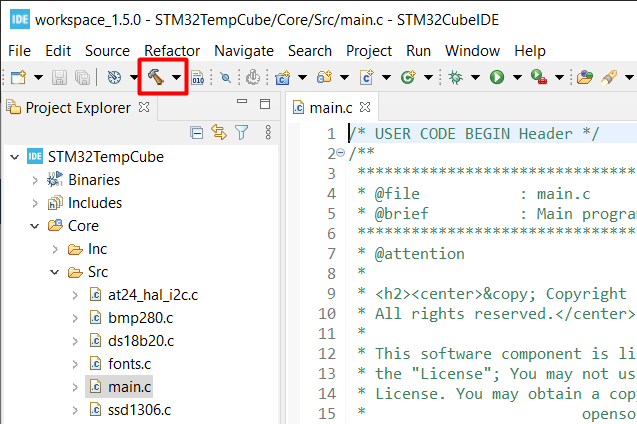
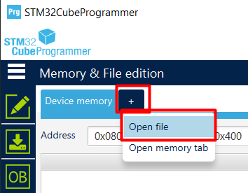
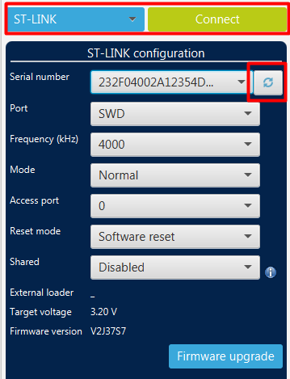
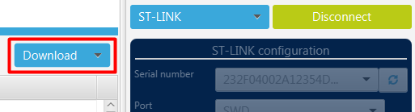
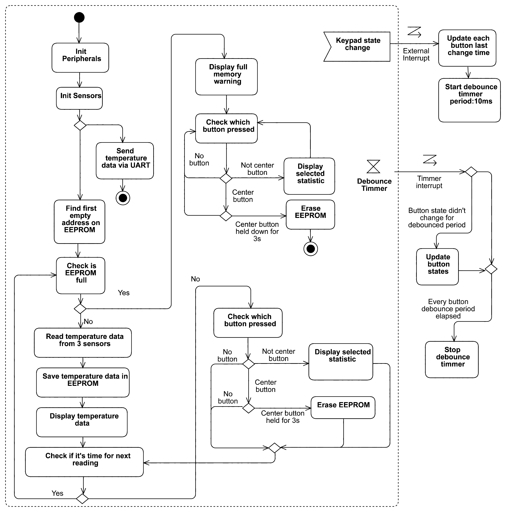

# STM32F103 Temperature Logging Device

## Overview
It's a simple device based on STM32F103C8T6 Blue Pill which measures, displays and saves temperature data from 3 different sensors. This data can be sent to computer in csv format which can be used to make temperature graph in Excel. Also it can display min and max values of all time or of last 24h.

With 256kbit EEPROM it can store 5376 temperature readings from 3 sensors that's over 18 days of logging if readings are made every 5 minutes.

## Results

## Hardware (could be bought at Aliexpress)
- STM32F103C8T6 Blue Pill
- ST-LINK V2 (for programming STM32)
- Temperature sensors:
    - BMP280 (I2C)
    - DS18B20 (1-Wire)
    - Thermistor (Analog)
- SSD1306 OLED display
- EEPROM ATMEL178 24C256 or 24C512
- 5 push buttons
- Wires, soldering equipment etc.

## How to setup
1. Build the circuit:

   
2. Download repository to your computer
3. Open [.project](.project) using [STMCubeIDE](https://www.st.com/en/development-tools/stm32cubeide.html)
4. Build the code

    

5. Connect STM32 via ST-LINK V2 to computer
6. Boot STM32 into programming mode by rebooting STM32 while BOOT0 pin is pulled high
7. In [STM32Programmer](https://www.st.com/en/development-tools/stm32cubeprog.html) press *Open file* and open [Debug/STM32TempCube.bin](Debug/STM32TempCube.bin) file

    

8. After refreshing *Serial number* should appear then press *Connect*

    

9. Press download to flash code to STM32
    
    

10. Pull BOOT0 pin to low and reboot STM32 and code should start running

## Other
- To send temperature data via UART reboot while holding up button
- To send data via UART external USB/UART converter is needed
- To receive serial data I recommend [Termite](https://www.compuphase.com/software_termite.htm)

## Algorithm diagram

